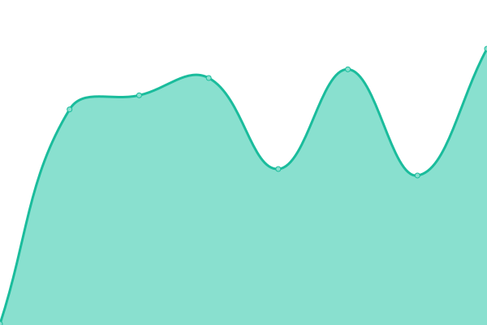
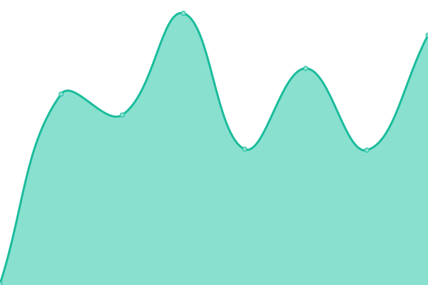

# [📈 Live Status](https://status.darwin.hk): <!--live status--> **🟧 Partial outage**

This repository contains the open-source uptime monitor and status page for [Upptime](https://upptime.js.org), powered by [Upptime](https://github.com/upptime/upptime).

With [Upptime](https://upptime.js.org), you can get your own unlimited and free uptime monitor and status page, powered entirely by a GitHub repository. We use [Issues](https://github.com/upptime/upptime/issues) as incident reports, [Actions](https://github.com/darwinhk/status/actions) as uptime monitors, and [Pages](https://status.darwin.hk) for the status page.

<!--start: status pages-->
<!-- This summary is generated by Upptime (https://github.com/upptime/upptime) -->
<!-- Do not edit this manually, your changes will be overwritten -->
<!-- prettier-ignore -->
| URL | Status | History | Response Time | Uptime |
| --- | ------ | ------- | ------------- | ------ |
|  [#网站# 达尔文主页(亚洲/Asia)](https://www.darwin.hk) | 正常 | [asia.yml](https://github.com/darwinhk/status/commits/HEAD/history/asia.yml) | 

 6151毫秒
     
 | 

<a href="https://status.darwin.hk/history/asia">100.00%</a>
    

|  [#网站# 达尔文主页(美国/U.S)](https://darwin.hk) | 正常 | [u-s.yml](https://github.com/darwinhk/status/commits/HEAD/history/u-s.yml) | 

 447毫秒
     
 | 

<a href="https://status.darwin.hk/history/u-s">100.00%</a>
    

|  [#网站# 授权用户控制台](https://dash.darwin.hk) | 正常 | [.yml](https://github.com/darwinhk/status/commits/HEAD/history/.yml) | 

 6765毫秒
     
 | 

<a href="https://status.darwin.hk/history/">92.91%</a>
    

|  [#服务# 数字许可权利管理](https://account.darwin.hk) | 正常 | [.yml](https://github.com/darwinhk/status/commits/HEAD/history/.yml) | 

 6765毫秒
     
 | 

<a href="https://status.darwin.hk/history/">92.92%</a>
    

|  [#服务# 云雷达数据中转 CNSH-1](http://cloudradar-cnsh.darwin.hk:27075) | 离线 | [cnsh-1.yml](https://github.com/darwinhk/status/commits/HEAD/history/cnsh-1.yml) | 

 665毫秒
     
 | 

<a href="https://status.darwin.hk/history/cnsh-1">87.31%</a>
    

|  [#服务# 云雷达数据中转 CNSH-2](http://cloudradar-cnsh.darwin.hk:27075) | 离线 | [cnsh-2.yml](https://github.com/darwinhk/status/commits/HEAD/history/cnsh-2.yml) | 

 302毫秒
     
 | 

<a href="https://status.darwin.hk/history/cnsh-2">90.46%</a>
    

|  [#服务# 云雷达数据中转 CNBJ-1](http://cloudradar-cnsh.darwin.hk:27075) | 离线 | [cnbj-1.yml](https://github.com/darwinhk/status/commits/HEAD/history/cnbj-1.yml) | 

 209毫秒
     
 | 

<a href="https://status.darwin.hk/history/cnbj-1">93.65%</a>
    

|  [#服务# 云雷达数据中转 CNSZ-1](http://cloudradar-cnsh.darwin.hk:27075) | 离线 | [cnsz-1.yml](https://github.com/darwinhk/status/commits/HEAD/history/cnsz-1.yml) | 

 311毫秒
     
 | 

<a href="https://status.darwin.hk/history/cnsz-1">100.00%</a>
    

|  [#订阅# CS:GO Premium](https://prd-status-csgo-premium.check.darwin.hk) | 正常 | [cs-go-premium.yml](https://github.com/darwinhk/status/commits/HEAD/history/cs-go-premium.yml) | 

 215毫秒
     
 | 

<a href="https://status.darwin.hk/history/cs-go-premium">92.56%</a>
    

|  [#订阅# CS:GO CloudRadar](https://prd-status-csgo-cloudradar.check.darwin.hk) | 正常 | [cs-go-cloud-radar.yml](https://github.com/darwinhk/status/commits/HEAD/history/cs-go-cloud-radar.yml) | 

 261毫秒
     
 | 

<a href="https://status.darwin.hk/history/cs-go-cloud-radar">94.79%</a>
    

|  [#订阅# PUBG Premium](https://prd-status-pubg-premium.check.darwin.hk) | 正常 | [pubg-premium.yml](https://github.com/darwinhk/status/commits/HEAD/history/pubg-premium.yml) | 

 235毫秒
     
 | 

<a href="https://status.darwin.hk/history/pubg-premium">100.00%</a>
    

<!--end: status pages-->

[**Visit our status website →**](https://status.darwin.hk)

## 📄 License

- Powered by: [Upptime](https://github.com/upptime/upptime)
- Code: [MIT](./LICENSE) © [Upptime](https://upptime.js.org)
- Data in the `./history` directory: [Open Database License](https://opendatacommons.org/licenses/odbl/1-0/)
