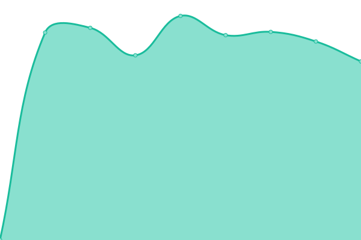

# [📈 Live Status](https://status.darwin.hk): <!--live status--> **🟧 Partial outage**

This repository contains the open-source uptime monitor and status page for [Upptime](https://upptime.js.org), powered by [Upptime](https://github.com/upptime/upptime).

With [Upptime](https://upptime.js.org), you can get your own unlimited and free uptime monitor and status page, powered entirely by a GitHub repository. We use [Issues](https://github.com/upptime/upptime/issues) as incident reports, [Actions](https://github.com/darwinhk/status/actions) as uptime monitors, and [Pages](https://status.darwin.hk) for the status page.

<!--start: status pages-->
<!-- This summary is generated by Upptime (https://github.com/upptime/upptime) -->
<!-- Do not edit this manually, your changes will be overwritten -->
<!-- prettier-ignore -->
| URL | Status | History | Response Time | Uptime |
| --- | ------ | ------- | ------------- | ------ |
|  [主页(Asia)](https://www.darwin.hk) | 🟩 Up | [asia.yml](https://github.com/darwinhk/status/commits/HEAD/history/asia.yml) | 

 6173ms
     
 | 

<a href="https://status.darwin.hk/history/asia">100.00%</a>
    

|  [主页(US/Source)](https://darwin.hk) | 🟩 Up | [us-source.yml](https://github.com/darwinhk/status/commits/HEAD/history/us-source.yml) | 

 516ms
     
 | 

<a href="https://status.darwin.hk/history/us-source">100.00%</a>
    

|  [数字许可](https://account.darwin.hk) | 🟥 Down | [.yml](https://github.com/darwinhk/status/commits/HEAD/history/.yml) | 

 6817ms
     
 | 

<a href="https://status.darwin.hk/history/">100.00%</a>
    

|  [控制台(用户中心)](https://dash.darwin.hk) | 🟥 Down | [.yml](https://github.com/darwinhk/status/commits/HEAD/history/.yml) | 

 6817ms
     
 | 

<a href="https://status.darwin.hk/history/">100.00%</a>
    

<!--end: status pages-->

[**Visit our status website →**](https://status.darwin.hk)

## 📄 License

- Powered by: [Upptime](https://github.com/upptime/upptime)
- Code: [MIT](./LICENSE) © [Upptime](https://upptime.js.org)
- Data in the `./history` directory: [Open Database License](https://opendatacommons.org/licenses/odbl/1-0/)
